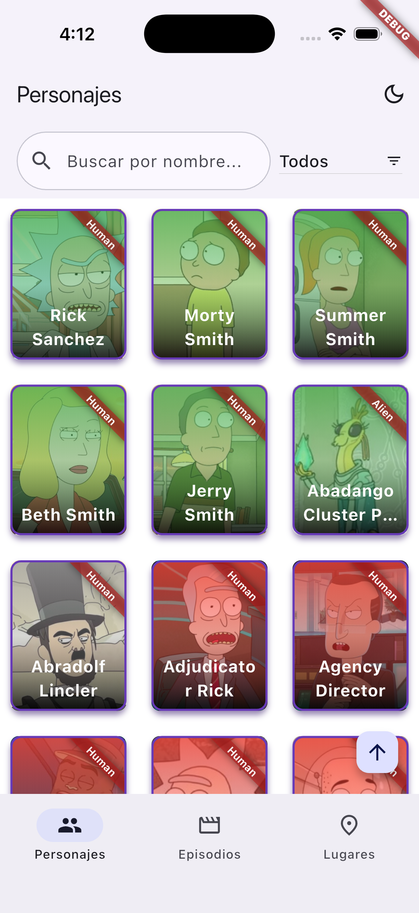
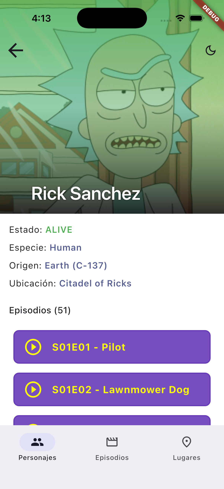
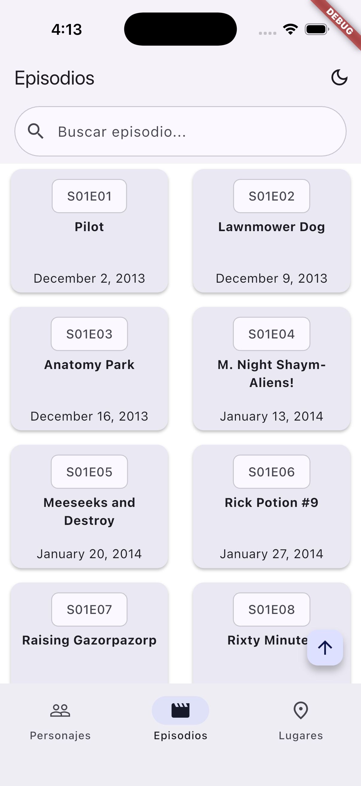
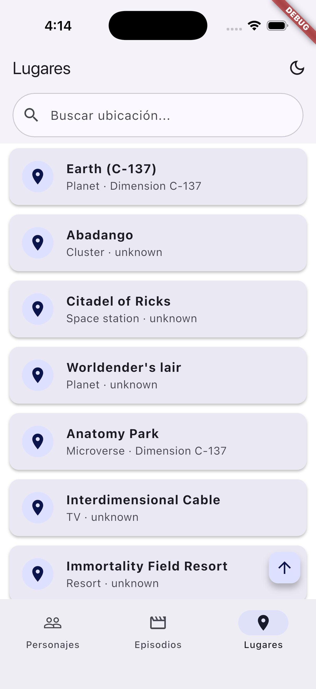
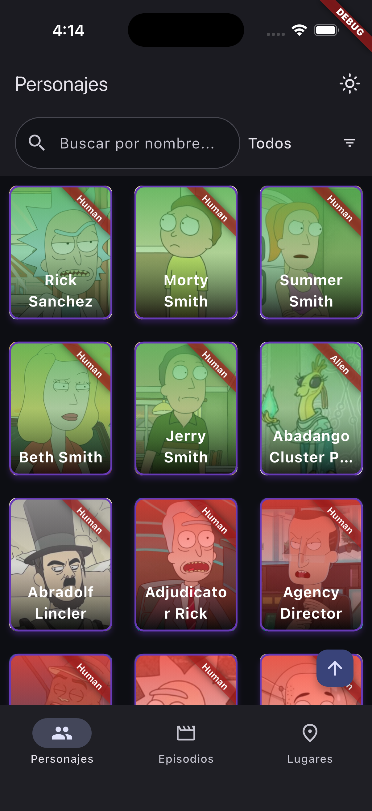

# Jarboss Challenge — Rick & Morty Explorer

Flutter app for the **technical challenge (Project 1)**: browse Rick & Morty characters with pagination, search, and filters, plus episode and location lists. Built with **Clean Architecture**, **Riverpod**, and **go_router**.

📦 **Repository:** [github.com/ergo-notch/jarboss_challenge](https://github.com/ergo-notch/jarboss_challenge)

---

## Screenshots

### Characters

| List | Detail |
|:----:|:------:|
|  |  |

### Episodes & Locations

| Episodes | Locations |
|:--------:|:---------:|
|  |  |

### Dark theme



---

## Features

- **Characters** — infinite scroll pagination, debounced search (~400 ms), status filter (`Alive` / `Dead` / `Unknown`), pull-to-refresh
- **Character detail** — Hero transition, species, type, origin, location, episode list
- **Episodes & Locations** — reusable paginated lists via shared `PaginatedListPage`
- **Bottom navigation** — Characters (center-docked FAB), Episodes, Locations
- **Material 3** — light/dark theme with in-app toggle
- **Error handling** — friendly messages, retry UI, 404 on list endpoints → empty state
- **REST client** — Dio-based `api_client` package with request throttling and debug logging

---

## Tech stack

| Layer | Choice |
|-------|--------|
| State | Riverpod (`StateNotifier`) |
| Navigation | go_router (`StatefulShellRoute`) |
| HTTP | Dio (`packages/api_client`) |
| Functional errors | dartz `Either` |
| Models | Equatable, immutable |

---

## Getting started

### Prerequisites

- [Flutter SDK](https://flutter.dev/docs/get-started/install) — tested with **Flutter 3.38.9** / **Dart 3.10.8**
- Android emulator, iOS simulator, or physical device

### 1. Clone and install

```bash
git clone https://github.com/ergo-notch/jarboss_challenge.git
cd jarboss_challenge
flutter pub get
```

### 2. Environment config

Create or use the included `config.json` at the project root:

```json
{
  "BASE_URL": "https://rickandmortyapi.com/api",
  "ENVIRONMENT": "development"
}
```

### 3. Run

```bash
flutter run --dart-define-from-file=config.json
```

---

## Project structure

```
jarboss_challenge/
├── lib/
│   ├── main.dart
│   ├── core/                          # Shared UI, router, pagination, repository
│   │   ├── data/                      # DataSource, Repository contracts
│   │   ├── domain/                    # Entities, use cases, RepositoryImpl
│   │   └── presentation/            # PaginatedListPage, MainShellPage, ViewModels
│   └── features/
│       ├── characters/                # List, tile, character-specific filter
│       ├── details/                   # Character detail screen
│       ├── episodes/
│       └── locations/
├── packages/
│   └── api_client/                    # Dio client, ApiException, throttle
├── test/                              # Unit + widget tests
├── docs/screenshots/                  # README screenshots (upload here)
├── config.json
└── USO_IA.md                          # AI usage documentation
```

---

## Architecture notes

**Clean Architecture per feature** — `data` → `domain` → `presentation`. Riverpod providers wire dependencies at the edge; repositories return `Either<AppException, T>`.

**Generic pagination** — `PaginatedListViewModel<T>` and `PaginatedListPage<T>` avoid duplicating scroll, search, and loading logic across characters, episodes, and locations. Each feature injects its own `fetchPage` callback into `AddPaginatedItemsByPageUseCase`.

**Rate limiting** — the public Rick & Morty API can return `429`. Outbound calls are serialized with a simple client-side throttle (1 request / 2 s). Pagination uses a lock and partial-failure UX (keep loaded items + retry footer). See [USO_IA.md](USO_IA.md) for the strategy comparison.

**Trade-offs**

| Decision | Why |
|----------|-----|
| Riverpod over get_it | Less boilerplate for a challenge-sized app; providers colocate with features |
| REST over GraphQL | Matches official API docs and challenge spec; simpler pagination mapping |
| Throttle over retry queue | Predictable behavior; avoids interceptor deadlocks under scroll |
| Indexed stack shell | Preserves scroll position when switching bottom tabs |

**With more time:** `cached_network_image`, character detail for episodes/locations, favorites persistence, golden tests, CI workflow.

---

## Testing

```bash
# All tests
flutter test

# Coverage report
flutter test --coverage
genhtml coverage/lcov.info -o coverage/html   # requires lcov
```

Current coverage:

- Repository implementation (success + error paths)
- `AddPaginatedItemsByPageUseCase` (merge pages, filters, last page)
- `PaginatedListViewModel` (refresh, fetchMore, search, partial errors)
- `CharactersPage` widget (loaded grid, empty state)

---

## Releases (APK)

Release builds use the **Android debug keystore** (no flavors, no production signing). The APK is published automatically to [GitHub Releases](https://github.com/ergo-notch/jarboss_challenge/releases) via GitHub Actions.

### Option A — Push a version tag (recommended)

```bash
git tag v1.0.0
git push origin v1.0.0
```

The workflow runs on tags matching `v*` and uploads `app-release.apk` to a new release.

### Option B — Manual trigger

1. Go to **Actions** → **Build and Release APK** → **Run workflow**
2. Enter a tag (e.g. `v1.0.0`) and run
3. Download the APK from **Releases** once the job completes

### Build locally

```bash
flutter build apk --release --dart-define-from-file=config.json
# Output: build/app/outputs/flutter-apk/app-release.apk
```

> **Note:** Replace the default `dart.yml` workflow on GitHub if you created it from the template — that template targets Dart packages, not Flutter apps. Use `.github/workflows/release-apk.yml` instead.

---

## AI usage

This project was developed with AI assistance (Cursor). Prompts, delegated work, and rejected suggestions are documented in **[USO_IA.md](USO_IA.md)**.

---

## Troubleshooting

| Issue | Fix |
|-------|-----|
| Missing env vars | Run with `--dart-define-from-file=config.json` |
| 429 / slow pagination | Expected with throttle; wait or scroll slower |
| Broken README images | Ensure PNGs are committed under `docs/screenshots/` and pushed to the default branch |
| iOS build errors | Run `cd ios && pod install`, check signing profile |
| `flutter analyze` warnings | Run from project root after `flutter pub get` |

---

## License

[MIT License](LICENSE)
